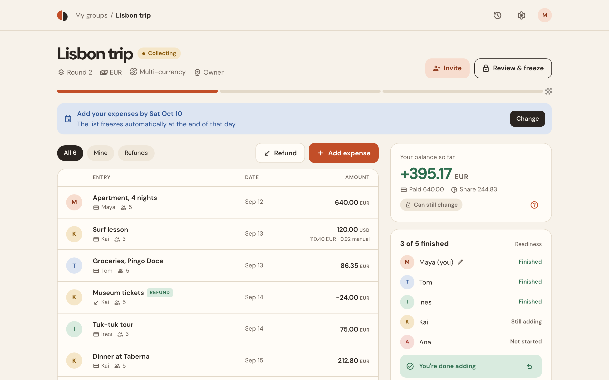
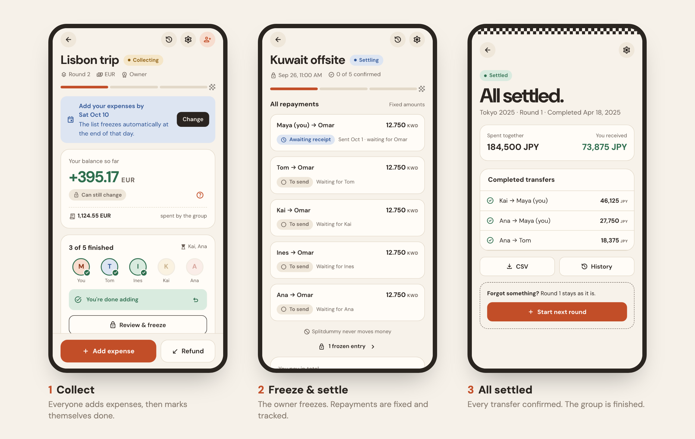
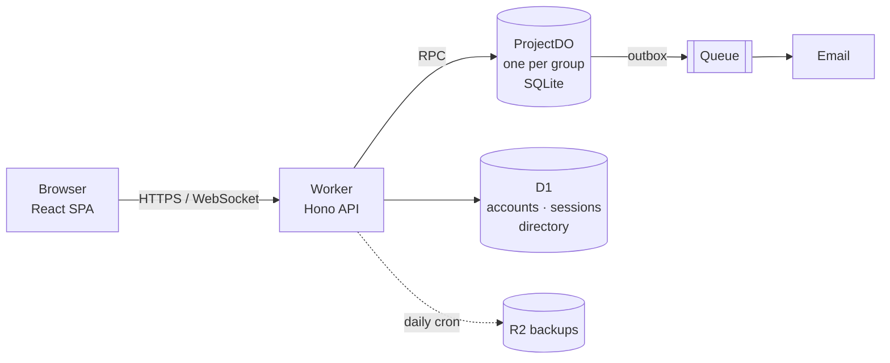

<div align="center">


# Splitdummy

**Split the costs. Know when you're done.**

A simple, mobile-first way to share trip and event expenses, with a clear finish line.<br>
Everyone adds what they paid, the owner freezes the list, and you get a fixed plan of who pays whom.

[**Try it at splitdummy.app**](https://splitdummy.app) · [API docs](https://splitdummy.app/docs/api) · [Architecture](docs/ARCHITECTURE.md)


</div>

<picture>
  <source media="(prefers-color-scheme: dark)" srcset="docs/assets/hero-dark.png">
  
</picture>

## Why another expense splitter?

Most splitting apps keep a running balance that never quite ends, and the "who owes whom" list changes every time someone adds a forgotten coffee. Splitdummy treats each trip as something you **finish**:

- **Repayments don't move.** Once the owner freezes the list, the transfers are fixed. Paying one person never changes what you owe someone else.
- **You can see who's still adding.** Each person marks *"Everything added from my side"*, so you know when the list is complete.
- **No passwords, and room for people who aren't signed up.** Friends join from a link by confirming their email. The owner can add someone by name and invite them by email later; when they join, they take over that spot with everything already split.

## How it works

<picture>
  <source media="(prefers-color-scheme: dark)" srcset="docs/assets/flow-dark.png">
  
</picture>

Forgot something after the freeze? Start a **new round**. Frozen rounds are never rewritten, so the history stays trustworthy.

## Features

|  |  |
|---|---|
| 💸 **Equal or exact splits** | One payer, any subset of people, cents allocated deterministically |
| 🌍 **Multi-currency** | Optional per group; saved manual rates, one settlement currency |
| 🔁 **Refunds** | First-class entries, never confused with repayments |
| ⏰ **Freeze deadline** | Optionally freeze the list automatically on a chosen date |
| 🤝 **Settlement tracking** | Sent → received or disputed, at most *n − 1* transfers |
| ⚡ **Live updates** | Changes appear instantly for everyone via WebSockets |
| 🧾 **Audit history and CSV export** | Every change is recorded; export a group to CSV |
| 🔑 **Public API** | Personal API keys, OpenAPI 3.1 schema, ready for scripts and AI agents |
| 🌗 **Light and dark** | Follows the system theme |

Splitdummy **never moves money**. Payments happen however your group prefers; the app tracks the confirmations.

## Quick start

```bash
git clone <this repo> && cd splitdummy
npm install
cp .dev.vars.example .dev.vars   # Turnstile test keys, sign-in links shown in the UI
npm run db:migrate:local
npm run dev                      # http://localhost:5173
```

To work on the UI without a backend, run `VITE_MOCK=1 npm run dev`. It uses an in-memory API with seeded demo groups and a **MOCK** panel for switching users and group states.

## Under the hood

The app is one Cloudflare Worker that serves the React app and the API. Each group lives in its own **Durable Object** with SQLite, which is the single source of truth for that group's money and permissions.



- **Exact money:** amounts are `bigint` minor units and exchange rates are exact rationals. There are no floats anywhere near a balance.
- **Atomic freeze:** the snapshot, balances and transfers are committed together, or not at all.
- **Security:** single-use magic-link sign-in, hashed tokens, Turnstile, rate limits and strict origin checks.

| Path | What's inside |
|---|---|
| `src/web/` | React 19 app (Vite, React Router) |
| `src/shared/` | API contracts (Zod) and the accounting core (`money/`) |
| `worker/` | Edge routes, auth, queue consumer, and `do/ProjectDO` |
| `migrations/` | D1 schema |
| `test/` | Worker tests running inside `workerd` |

More detail is in [docs/ARCHITECTURE.md](docs/ARCHITECTURE.md) and the [product spec](docs/splitdummy-development-handoff.md).

## Testing

```bash
npm test              # everything
npm run test:shared   # accounting core (includes property-based tests)
npm run test:worker   # API + Durable Objects in workerd
npm run test:web      # UI (jsdom)
npm run typecheck
```

<details>
<summary><b>Deploy your own</b></summary>

<br>

Splitdummy runs entirely on Cloudflare. Before you deploy:

1. In `wrangler.jsonc`, set your own `account_id`, domains, `APP_ORIGIN` and `EMAIL_FROM`.
2. Create the resources: a D1 database (put its ID in the config), the Queues and dead-letter queues, an R2 bucket, and a Turnstile widget (put its site key in `wrangler.jsonc` and `scripts/deploy.sh`).
3. Enable [Email Service](https://developers.cloudflare.com/email-service/) sending for your domain.

```bash
scripts/deploy.sh staging --init-secrets   # first deploy of an environment
scripts/deploy.sh production               # typecheck, build, migrate D1, deploy
```

</details>

## Contributing

Issues and pull requests are welcome. Please keep commits small and [conventional](https://www.conventionalcommits.org/) (`feat(web): …`, `fix(do): …`), and make sure `npm test` and `npm run typecheck` pass. If you change the shared contracts in `src/shared/api.ts`, extend them additively.

## License

A license has not been chosen yet.
